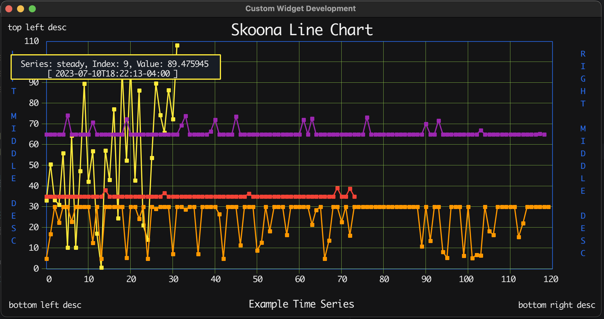

# SknLineChart
LineChart written to display periodic data samples on a line chart, with the ability to display the point value when hovered over with pointer.  There is an unlimited number of series which can be displayed. However, the current maximum number of points per series that can be shown on screen is 150 xpoints.  Accumulated point counts greater 150 simply roll off the end.    



## Features
* Multiple Series of data points rendered as a individual line
* Series should be the same color. Each point in this chart accepts a themed color name
* 150 datapoint are displayed on the x scale of chart, with 100 as the default Y value.
* More than 150 data points causes the earliest points to be rolled off the screen; each series independently scrolls when limit is reached
* Data points can be added at any time, causing the series to possible scroll automatically
* The 150 x limit will throw and error on creation of the chart, or on the replacement of its active series.
* Data point markers are toggled with mouse button 2
* Hovering over a data point will show a popup near the mouse pointer, showing series, value, index, and timestamp of data under mouse
* Mouse button 1 will toggle the sticky hover popup
* Labels are available for all four corners of window, include bottom and top centered titles
* left and right middle labels can be used as scale descriptions
* Any label left empty will not be displayed.
* Horizontal and Vertical chart grid lines can also be turned off/on
* There is a callback available which fires when a point if hovered over; passing the full datapoint and series name.
* A `GraphPointSmoothing` interface is available to enable preprocessing of datapoints with a range of possible techniques, averaging was implemented as an example.

### SknLineChart Interface
```go
package sknlinechart

import "fyne.io/fyne/v2"

// GraphPointSmoothing support for different implementation
// of averaging or smooth data; current provides rolling average from last x reading.
type GraphPointSmoothing interface {
	AddValue(value float64) float64
	SeriesName() string
	IsNil() bool
	String() string
}

// ChartDatapoint data container interface for LineChart
type ChartDatapoint interface {
	Value() float32
	SetValue(y float32)

	ColorName() string
	SetColorName(n string)

	Timestamp() string
	SetTimestamp(t string)

	// ExternalID string uuid assigned when created
	ExternalID() string

	// Copy returns a cloned copy of current item
	Copy() ChartDatapoint

	// MarkerPosition internal use only: current data point marker location
	MarkerPosition() (*fyne.Position, *fyne.Position)

	// SetMarkerPosition internal use only: screen location of where data point marker is located
	SetMarkerPosition(top *fyne.Position, bottom *fyne.Position)
}

// LineChart feature list
type LineChart interface {
	// Chart Attributes

	IsDataPointMarkersEnabled() bool // mouse button 2 toggles
	IsHorizGridLinesEnabled() bool
	IsVertGridLinesEnabled() bool
	IsColorLegendEnabled() bool
	IsMousePointDisplayEnabled() bool // hoverable and mouse button one

	SetDataPointMarkers(enable bool)
	SetHorizGridLines(enable bool)
	SetVertGridLines(enable bool)
	SetColorLegend(enable bool)
	SetMousePointDisplay(enable bool)

	// Scale legend

	GetMiddleLeftLabel() string
	GetMiddleRightLabel() string

	// Info Labels

	GetTopLeftLabel() string
	GetTitle() string
	GetTopRightLabel() string
	GetBottomLeftLabel() string
	GetBottomCenteredLabel() string
	GetBottomRightLabel() string

	SetTopLeftLabel(newValue string)
	SetTitle(newValue string)
	SetTopRightLabel(newValue string)
	SetMiddleLeftLabel(newValue string)
	SetMiddleRightLabel(newValue string)
	SetBottomLeftLabel(newValue string)
	SetBottomCenteredLabel(newValue string)
	SetBottomRightLabel(newValue string)

	// ApplyDataSeries add a whole data series at once
	// expect this will rarely be used, since loading more than 130 point will raise error
	ApplyDataSeries(seriesName string, newSeries []*ChartDatapoint) error

	// ApplyDataPoint primary method to add another data point to any series
	// If series has more than 130 points, point 0 will be rolled out making room for this one
	ApplyDataPoint(seriesName string, newDataPoint *ChartDatapoint)

	// SetMinSize set the minimum size limit for the linechart
	SetMinSize(s fyne.Size)

	// EnableDebugLogging turns method entry/exit logging on or off
	EnableDebugLogging(enable bool)

	// SetHoverPointCallback method to call when a onscreen datapoint is hovered over by pointer
	SetOnHoverPointCallback(func(series string, dataPoint ChartDatapoint))

	// ObjectCount internal use only: return the default ui elements for testing
	ObjectCount() int

	// fyne.CanvasObject compliance
	// implemented by BaseWidget
	Hide()
	MinSize() fyne.Size
	Move(position fyne.Position)
	Position() fyne.Position
	Refresh()
	Resize(size fyne.Size)
	Show()
	Size() fyne.Size
	Visible() bool
}
```

## Fyne Custom Widget Strategy
```go
/*
 * SknLineChart
 * Custom Fyne 2.0 Widget
 * Strategy
 * 1. Define Widget Named/Exported Struct
 *    1. export fields when possible
 * 2. Define Widget Renderer Named/unExported Struct
 *    1. un-exportable fields when possible
 * 3. Define NewWidget() *ExportedStruct method, related interface should have different name.
 *    1. Define state variables for this widget
 *    2. Extend the BaseWidget
 *       1. If coding SetMinSize(fyne.Size), use saved value in MinSize() in rendered 
 *    3. Define Widget required methods
 *       1. CreateRenderer() fyne.WidgetRenderer, call newRenderer() below
 *       2. Renderer has the other required methods, like Refresh(), etc.
 *    4. Define any methods required by additional interfaces, like
 *       desktop.Mouseable for mouse button support
 *       1. MouseDown(me MouseEvent)
 *       2. MouseUp(me MouseEvent)
 *       desktop.Hoverable for mouse movement support
 *       1. MouseIn(me MouseEvent)
 *       2. MouseMoved(me MouseEvent)  used to display data point under mouse
 *       3. MouseOut()
 * 4. Define newRenderer() *notExportedStruct method
 *    1. Create canvas objects to be used in display
 *    2. Initialize their content if practical; not required
 *    3. Implement the required WidgetRenderer methods
 * 	  4. Refresh()               reload/update value if changed, call refresh on each object
 * 	  5. Layout(s fyne.Size)     resize & move objects 
 * 	  6. MinSize()  fyne.Size    return the minimum size needed
 * 	  7. Object() []fyne.Canvas  return the objects to be displayed
 * 	  8. Destroy()               cleanup if needed to prevent leaks
 * 5. In general widget state methods are the public api with or without getters/setters
 *    and the renderer creates the displayable objects, applies state/value to them, and
 *    manages their display.
 *
 * Critical Notes:
 * - if using maps, map[string]interface{}, they will require a mutex to prevent concurrency errors caused my concurrent read/writes.
 */
```


### Example
```go
package main

import (
	"fmt"
	"fyne.io/fyne/v2"
	"fyne.io/fyne/v2/app"
	"fyne.io/fyne/v2/container"
	"fyne.io/fyne/v2/theme"
	lc "github.com/skoona/sknlinechart"
	"log"
	"math/rand"
	"os"
	"os/signal"
	"syscall"
	"time"
)

func makeChart(title, footer string) (lc.LineChart, error) {
	dataPoints := map[string][]*lc.ChartDatapoint{} // legend, points

	rand.NewSource(1000.0)
	for x := 1; x < 151; x++ {
		val := rand.Float32() * 75.0
		if val > 75.0 {
			val = 75.0
		} else if val < 30.0 {
			val = 30.0
		}
		point := lc.NewChartDatapoint(val, theme.ColorBlue, time.Now().Format(time.RFC1123))
		dataPoints["Humidity"] = append(dataPoints["Humidity"], &point)
	}
	for x := 1; x < 151; x++ {
		val := rand.Float32() * 75.0
		if val > 95.0 {
			val = 95.0
		} else if val < 55.0 {
			val = 55.0
		}
		point := lc.NewChartDatapoint(val, theme.ColorRed, time.Now().Format(time.RFC1123))
		dataPoints["Temperature"] = append(dataPoints["Temperature"], &point)
	}

	lineChart, err := lc.NewLineChart(title, footer, &dataPoints)
	if err != nil {
		fmt.Println(err.Error())
		if lineChart == nil {
			panic(err.Error())
		}
	}
	lineChart.EnableDebugLogging(true)
	lineChart.SetTopLeftLabel("top left")
	//lineChart.SetTopRightLabel("top right")

	lineChart.SetMiddleLeftLabel("Temperature")
	lineChart.SetMiddleRightLabel("Humidity")

	lineChart.SetBottomLeftLabel("bottom left")
	lineChart.SetBottomRightLabel("bottom right")

	return lineChart, err
}

func main() {
	systemSignalChannel := make(chan os.Signal, 1)
	exitCode := 0
	windowClosed := false
	logger := log.New(os.Stdout, "[DEBUG] ", log.Lmicroseconds|log.Lshortfile)
	gui := app.NewWithID("net.skoona.sknLineChart")
	w := gui.NewWindow("Custom Widget Development")

	lineChart, err := makeChart("Skoona Line Chart", "Example Time Series")

	go (func(chart lc.LineChart) {
		var many []*lc.ChartDatapoint
		for x := 1; x < 161; x++ {
			val := rand.Float32() * 25.0
			if val > 50.0 {
				val = 50.0
			} else if val < 5.0 {
				val = 5.0
			}
			point := lc.NewChartDatapoint(val, theme.ColorPurple, time.Now().Format(time.RFC1123))
			many = append(many, &point)
		}
		time.Sleep(10 * time.Second)
		err = lineChart.ApplyDataSeries("AllAtOnce", many)
		if err != nil {
			logger.Println("ApplyDataSeries", err.Error())
		}
		time.Sleep(time.Second)

		smoothed := lc.NewGraphAverage("SmoothStream", 32)
		for i := 0; i < 151; i++ {
			if windowClosed {
				break
			}
			dVal := float64(rand.Float32() * 110.0)
			smoother := smoothed.AddValue(dVal)
			point := lc.NewChartDatapoint(float32(smoother), theme.ColorYellow, time.Now().Format(time.RFC1123))
			chart.ApplyDataPoint("SmoothStream", &point)

			point2 := lc.NewChartDatapoint(float32(dVal), theme.ColorPurple, time.Now().Format(time.RFC1123))
			chart.ApplyDataPoint("SteadyStream", &point2)
			if windowClosed {
				break
			}
			time.Sleep(time.Second)
		}
	})(lineChart)

	lineChart.SetOnHoverPointCallback(func(series string, p lc.ChartDatapoint) {
		logger.Printf("Chart Datapoint Selected Callback: series:%s, point: %v\n", series, p)
	})

	w.SetContent(container.NewPadded(lineChart))
	w.Resize(fyne.NewSize(982, 452))

	go func(w *fyne.Window, stopFlag chan os.Signal) {
		signal.Notify(stopFlag, syscall.SIGINT, syscall.SIGTERM)
		sig := <-stopFlag // wait on ctrl-c
		windowClosed = true
		logger.Println("Signal Received: ", sig.String())
		exitCode = 1
		(*w).Close()
	}(&w, systemSignalChannel)

	w.ShowAndRun()

	os.Exit(exitCode)
}

```

### Project Layout
```
├── LICENSE
├── README.md
├── cmd
│   └── sknlinechart
│       └── main.go
├── go.mod
├── go.sum
├── datapoint.go
├── linechartinterfaces.go
├── linechart.go
└── mapsliceutils.go

```

### Installing

1. Clone this repo in your GO src directory
2. Install Go
3. Install Fyne
4. Install Ginkgo
5. possibly update your `../go.work` file to include this module
6. `go mod tidy`
7. `go run com/sknlinechart/main.go`

### Contributing

1. Fork it
2. Create your feature branch (`git checkout -b my-new-feature`)
3. Commit your changes (`git commit -am 'Add some feature'`)
4. Push to the branch (`git push origin my-new-feature`)
5. Create a new Pull Request to `development` branch


### LICENSE
The application is available as open source under the terms of the [MIT License](http://opensource.org/licenses/MIT).
